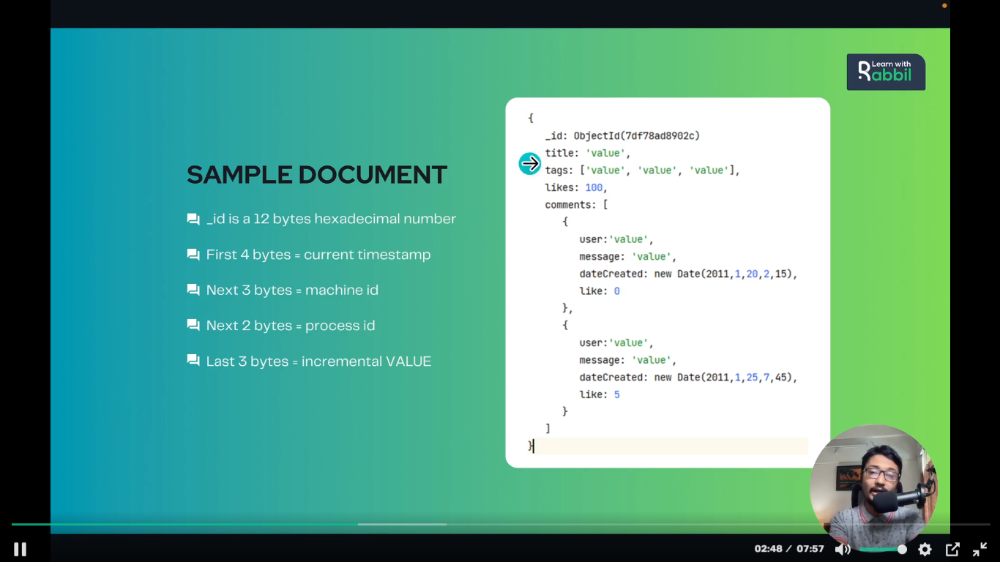

## Akhon amra janbo mongodb te amra ki ki data type niye kaj korte pari:
1. ### String 
2. ### Integer- 32 and 64 bit jkono bit eri hote pare.
3. ### Boolean
4. ### Double
5. ### Min/Max Keys - This datatype compare a value against the lowest and highest BSON elements.
6. ### Arrays
7. ### Object
8. ### Null
9. ### Symbol - it is generall used for languages that use a specific type. 
10. ### Date
- ### akhane muloto amra string,integer, boolean,double, arrays,object,null, Data beshi kaj kore takhi.

- ### MongoDB te jokon apni akta simple akta document create korben,shei document er moddhe mongoDB by default `_id` name a akta object id create korbe - j object id ta oi document er akta primary key hishebe kaj korbe. Aichara oi document er moddhe j tottho gula takbe shegula  mongoDB json akhare rakbe. Jerokom apnara nicher chobita te dekte paccen. 

- ### MongoDB te jokon amra kono document insert kori Chobite dekhano example er moto document gula collection a er bithor store hoi.
- ### Default j `_id` diye primary key generate hocce, shei primary key er abr akta definition ache:
    - ### ai `_id` hocce 12 bytes er akta hexadecimal number. Jotobar amra notun document create korbo totobar 12 bytes er akta unique hexadecimal number generate hobe. Ai 12 bytes gular abr nijossho meaning ace:
        - ### first 4 bytes diye bujano hoi current timestamp.
        - ### porer 3 bytes machine id(kon device/ kon server bujacce machine bolte) nirdesh kore.
        - ### porer 2 bytes process id nirdesh kore.
        - ### last 3 bytes incremental Value nirdesh korce.