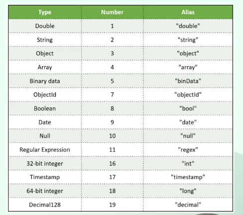

## Element Query Operator 2ta `$exists` and `$type`.
- ### Jehetu mongodb amader akta schema less freedom dei, othad amra eki collection er bithore bibinno rokomer document insert korte pari: Structured, Unstructured, Semistructured -jevabe kushi. Tai 1ta collection er ek-ekta document er moddhe ek-ekdhorner property taktei pare. Dorun 1st document er moddhe 5ta property ache and 2nd document er moddhe 6ta ace.Toh 1st document a j 5ta property ache, 2nd document te giye shei property gula r nai, onnorokom property ache. Toh property er name, type and shonkha aikhane vary korte pare, jehetu mongoDB amader akta schema less freedom dicce. Say Amra jodi kono akta document a kono akta property exist kore kina, sheta check korte chaile `$exists` operator use korte pari. kono akta specific field er type kotw giye string, kotaw giye number, kotaw giye boolean etc hote pare. Orthad eki field er binno binno type binno binno document er moddhe takhte pare.Shekhetre `$type`use korte pari field er type check korer jonno.
- ### MongoDB te amra j dattype gula niye kaj kori, shei datatype gular abr akta numbering ache:


```javascript
db.employees.find(      
  {
    salary:{$type:true}//value ture dile j j document a salary takhbe shegula select korbe r value false dile j j document a salary property takhbe na shegula select korbe.
  }   
)
```

```javascript
db.employees.find(      
  {
    city:{$type:2}
  }
)
```
