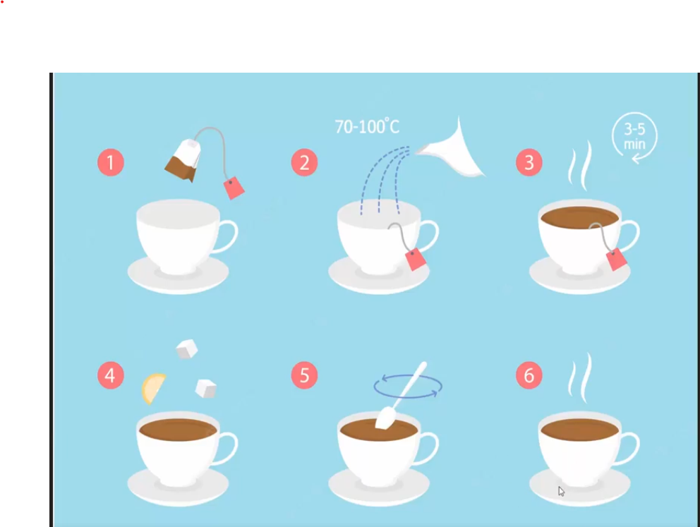

##Collection er Row count:

```javascript
db.employees.find().count('total'); //akta collection a total koita document ache sheta bole dibe.
```

### Aggregation: 
- ### Dorun apni cha(tea) banaben, toh tea bag diye jodi cha banan:
    - ### 1st phase a apnake cup er bithore tea-bag nite hobe.
    - ### 2nd phase a apni tea-bag er upor gorom pani dalben
    - ### 3rd phase a apni cha er cup ta 3-4min er jonno rekhe diben tea-bag shoho.
    - ### 4th phase a apni adha(ginger) deben, lebu deben
    - ### 5th phase a apni cha ta k kuv valovabe chamoch diye narben.
    - ### 6th phase a apner cha ready.

- ### Toh ai puro process ta k bola hocce pipeline. R ek-ekta phase k amra bolbo stage. Keyal korun pipeline ta suru hoyece 1st phase a and sesh hoyece 6th phase a. Tahole ai 6 ta phase mile akta process. Tahole bola jai ai cha bananor puro process ta hocce akta pipeline. Finally shei process er output ek cup cha. Aggregation er bishoita o tik shei rokom. Aggregation a o amra daphe daphe(step by step) kaj kore finally output ber kore niye ashi. Tahole ai aggregation use kore amra daphe-daphe query chaliye, shegula k bibinno size-shape diye,amra amader moto kore finally akta output niye aste pari.


```javascript
db.employees.aggregate(
    // aggregate er moddhe o 'how to make a cup of tea' er motoi akta pipeline make korte hoi.
    // aikhane [] => indicate kore akta puro pipeline k and [] er bithore amader k stage likhte hobe {} er moddhe like below.
    [
        { dorun ata jehetu phase 1 : tai tea bag dilam}, //tahole agula hocce amader stage
        {phase 2: goro pani dallam cup a}, //ata o stage 
        {phase 3: 3-4 min rekhe dilam},//ata o stage 
        {phase 4: adha and lebu dilam},//ata o stage 
        {phase 5: cha ta k valovabe narlam},//ata o stage 
        {phase 6: finally amra cha pelam}//shobgulai stage 
    ]// r ata pipeline
)
```
- ### Tar mane aggregation use kore amra data datbase tekhe niye aste parbo as like as make a cup of tea.


```javascript
use('CraftShop')

// dorun amra aggregation use kore counting korbo tar mane aikhane amader shudu akta stage:
db.employees.aggregate(
    [
        { $count: 'total'}, //employees collection a total koita document ache sheta bole dibe.
    ]
)
```