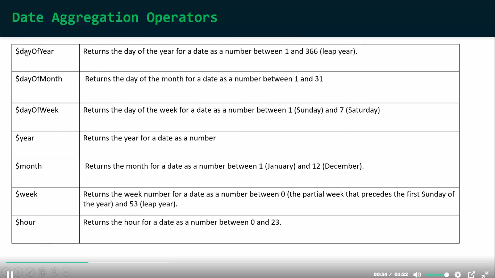

## date aggregation operators




```javascript
use('AmazonDB')


db.products.aggregate([
    { $match: { price: { $gt: 999 } } },
    { 
        $addFields: { 
            "rajesh": { $dayOfYear:"$createdAt"} // akta year er kototomon din sheta ber kore niye ashbe.
        }
    },
]);

//output
[
  {
    "_id": {
      "$oid": "6795b1017c63944999d4bb55"
    },
    "productId": 3,
    "categoryId": 1,
    "brandId": 1,
    "name": "MacBook Pro",
    "price": 1299,
    "unit": "pcs",
    "details": "16-inch MacBook Pro",
    "createdAt": {
      "$date": "2023-01-03T12:00:00Z"
    },
    "rajesh": 3
  },
  {
    "_id": {
      "$oid": "6795b1017c63944999d4bb5b"
    },
    "productId": 9,
    "categoryId": 3,
    "brandId": 5,
    "name": "Refrigerator",
    "price": 1000,
    "unit": "pcs",
    "details": "Double-door fridge",
    "createdAt": {
      "$date": "2023-01-09T18:00:00Z"
    },
    "rajesh": 9
  },
  {
    "_id": {
      "$oid": "6795b1017c63944999d4bb69"
    },
    "productId": 23,
    "categoryId": 3,
    "brandId": 5,
    "name": "Refrigerator",
    "price": 1000,
    "unit": "pcs",
    "details": "Double-door fridge",
    "createdAt": {
      "$date": "2023-01-23T18:00:00Z"
    },
    "rajesh": 23
  }
]
```