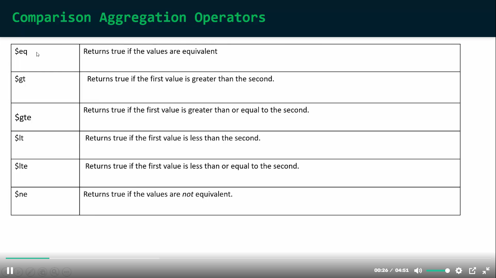

## comparison aggregation operators
- ### Er aghe o amra comparison operator use korechi. But aggregation er moddhe comparison operator agher dekhe asha comparison operator er example gular moto kaj kore na. Ai Operators gula jeta korbe sheta hocce true / false return korbe condition er upor base kore.


## use:
```javascript
use('AmazonDB')


db.products.aggregate([
    { $match: { price: { $gt: 999 } } },
    { 
        $addFields: { 
            "IsPriceEqualTo1k": {$eq:["$price",1000] }
        }
    },
    // aikhane 2 stage er moddhe valo kore keyal koro, comparison operators gula kokon kivabe kaj korce. 1st stage a sha(comparison operator) select korce shei shob document jgula 1st stage a dewa condition k satisfy kore. And 2nd stage sha(comparison operator) true/false return korce according to the condition. 
]);

//ouptut:
[
  {
    "_id": {
      "$oid": "6795b1017c63944999d4bb55"
    },
    "productId": 3,
    "categoryId": 1,
    "brandId": 1,
    "name": "MacBook Pro",
    "price": 1299,
    "unit": "pcs",
    "details": "16-inch MacBook Pro",
    "createdAt": {
      "$date": "2023-01-03T12:00:00Z"
    },
    "IsPriceEqualTo1k": false
  },
  {
    "_id": {
      "$oid": "6795b1017c63944999d4bb5b"
    },
    "productId": 9,
    "categoryId": 3,
    "brandId": 5,
    "name": "Refrigerator",
    "price": 1000,
    "unit": "pcs",
    "details": "Double-door fridge",
    "createdAt": {
      "$date": "2023-01-09T18:00:00Z"
    },
    "IsPriceEqualTo1k": true
  },
  {
    "_id": {
      "$oid": "6795b1017c63944999d4bb69"
    },
    "productId": 23,
    "categoryId": 3,
    "brandId": 5,
    "name": "Refrigerator",
    "price": 1000,
    "unit": "pcs",
    "details": "Double-door fridge",
    "createdAt": {
      "$date": "2023-01-23T18:00:00Z"
    },
    "IsPriceEqualTo1k": true
  }
]
```