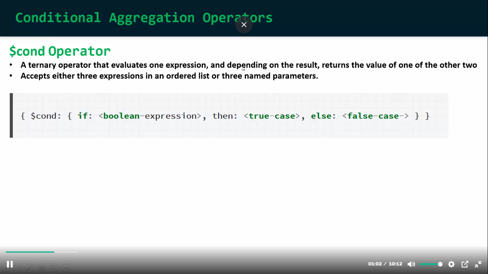
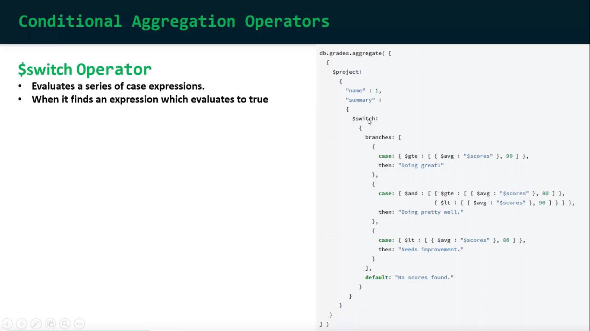

## Conditional Aggregation Operators:
- ### Conditional operator er maddhome amra query er moddhe if-else and swithc-case condition likhte pari. 

```javascript
use('AmazonDB')


db.products.aggregate([
    {
        $project: {
          _id:0,
          "name": 1,
          "price":1,
          "unit":1,
          "details":1,
          "priceAssumption":{
            $cond:{
                if:{$lte:["$price",800]},
                then:"Less Price",
                else:"Standard Price"
            }
          }
        }
    },
    {
        $limit: 5
    }
]);

//output
[
  {
    "name": "iPhone 14",
    "price": 999,
    "unit": "pcs",
    "details": "Latest iPhone model",
    "priceAssumption": "Standard Price"
  },
  {
    "name": "Galaxy S23",
    "price": 899,
    "unit": "pcs",
    "details": "Latest Samsung flagship",
    "priceAssumption": "Standard Price"
  },
  {
    "name": "MacBook Pro",
    "price": 1299,
    "unit": "pcs",
    "details": "16-inch MacBook Pro",
    "priceAssumption": "Standard Price"
  },
  {
    "name": "Air Max 90",
    "price": 150,
    "unit": "pair",
    "details": "Classic running shoe",
    "priceAssumption": "Less Price"
  },
  {
    "name": "Air Force 1",
    "price": 120,
    "unit": "pair",
    "details": "Iconic basketball shoe",
    "priceAssumption": "Less Price"
  }
]
```
- ### ai $cond operator use kore amra kub shojei query er moddhe if-else condition likhte pari.
- ### ai operator er limitation hocce amra shudu akta condition check korte pari. Jodi amn hoi j amader multiple condition check korte hocce tokon amra $switch operator use korte pari:

```javascript
```
- ### ai $cond and $switch operator niye kaj korte hole projection make kore nite hobe na hole aigula tikvabe kaj na o korte pare.